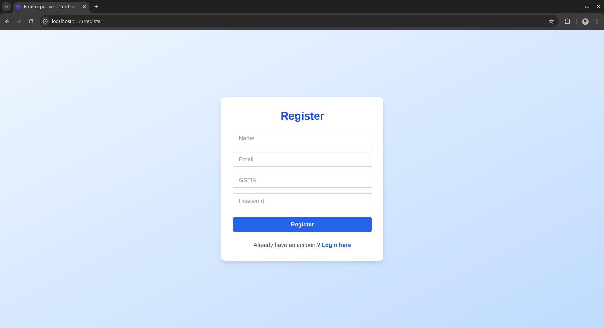
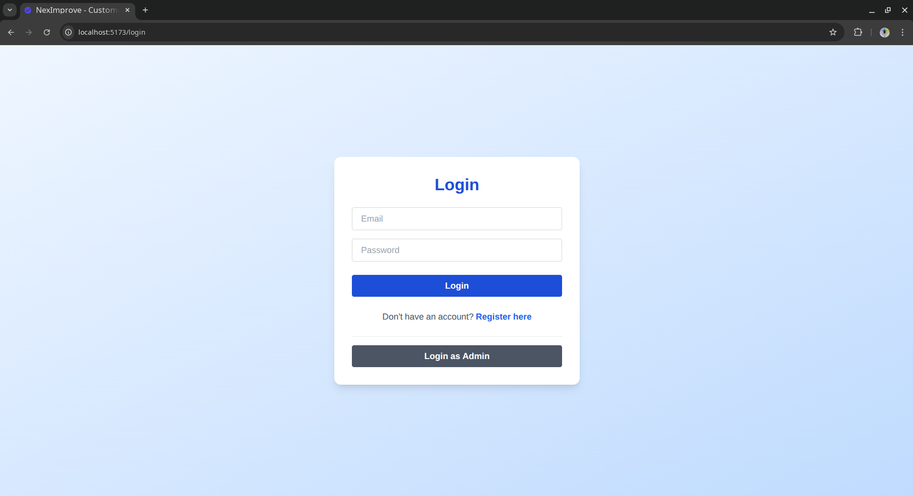
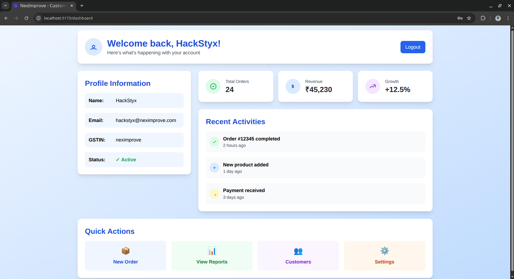
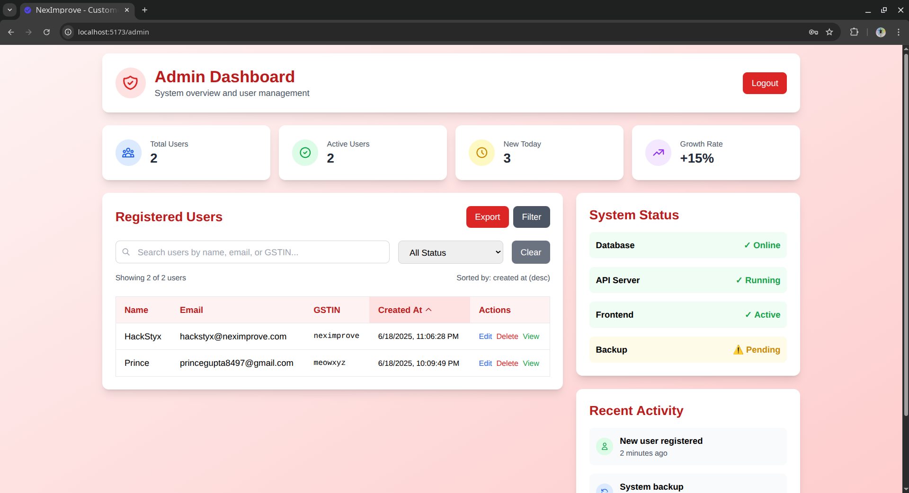
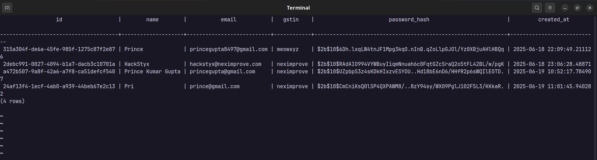

## 📷 Screenshots

### 📝 Registration Page
Shows the user registration form with Name, Email, GSTIN, and Password fields.

---

### 🔐 Login Page
Displays the login form with email and password inputs for authenticated access.

---

### 📊 User Dashboard
After successful registration or login, users are redirected to their dashboard with their profile details.

---

### 🧑‍💼 Admin Dashboard
Displays a list of all onboarded users, fetched from the PostgreSQL database.

---

### 🗃️ PostgreSQL Users Table
Screenshot showing the `users` table in PostgreSQL with sample entries.

